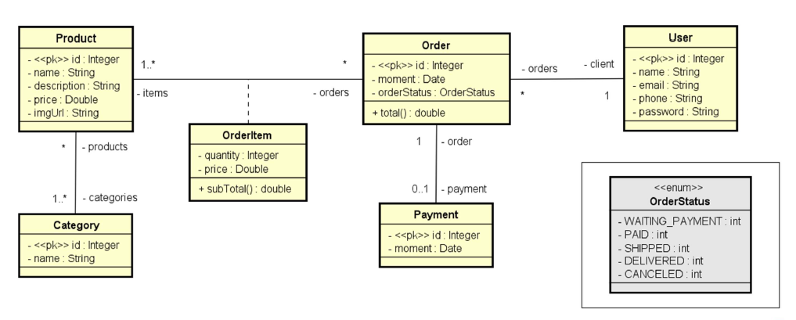

# Sistema de pedidos

## Sobre o projeto
O sistema back-end permite o usuário realizar pedidos de produtos (cada um possui sua categoria) e fazer buscas paginada. A arquitetura está dividida nas camadas resource (controller), service e reposotory.

## Tecnologias utilizadas
* Java
* Spring Boot
* Spring Rest
* Spring Data JPA
* Banco de Dados H2

## Modelo de domínio

## Organização das camadas

## Autor
Raul Santos Gonçalves

[https://www.linkedin.com/in/raul-gonçalves-641310190/](https://www.linkedin.com/in/raul-gonçalves-641310190/)
